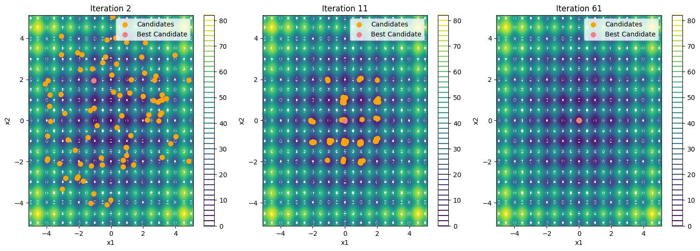

# Optimizing benchmark functions using Atomic Orbital Search (AOS) with ABC for parameter selection

## Overview
This project aims to implement the Atomic Orbital Search (AOS) metaheuristic for solving mathematical optimization problems and to enhance its performance using parameter optimization through Artificial Bee Colony (ABC). The project will compare AOS’s performance with Particle Swarm Optimization (PSO) and Genetic Algorithm (GA) using metrics such as convergence speed, computational time, and solution accuracy; statistical comparisons are included. Simulations are carried out in Python, and the results are visualized in tables.

## Atomic Orbital Search (AOS)

This repository includes an implementation of the **Atomic Orbital Search (AOS)** algorithm, a metaheuristic optimization method inspired by quantum mechanics and the behavior of electrons within atomic orbitals.

### **Algorithm Overview**
AOS is a **population-based search algorithm** where each electron represents a candidate solution, and the nucleus corresponds to a region in the search space where high-quality solutions are concentrated. The algorithm maintains a balance between **exploration** and **exploitation** by simulating the probabilistic movement of electrons across different orbital layers:

- **Exploration:** Achieved through stochastic transitions, allowing electrons to move across diverse regions in the search space.  
- **Exploitation:** Ensured by adjusting candidate solutions toward better regions, guided by interactions between electrons and the nucleus.  

A key feature of AOS is its **energy absorption and emission mechanism**, which dynamically regulates the movement of solutions. This mechanism helps **prevent premature convergence** and **ensures thorough coverage of the search space**, improving optimization efficiency.

### **Implementation Details**
- The AOS algorithm is implemented in **Python** and can be applied to various optimization problems.  
- The repository provides a structured implementation, including parameter tuning and benchmarking against other metaheuristic algorithms.  
- The performance of AOS is evaluated using **benchmark functions** and compared to **Genetic Algorithm (GA)** and **Particle Swarm Optimization (PSO)**.  

For further details on the AOS algorithm, refer to [Azizi, 2021](https://doi.org/10.1016/j.apm.2020.12.021).  

## Objective functions
The test functions used in this study are standard benchmarks in mathematical optimization, each function is characterized by its complexity, dimensionality, and the type of optima it presents (global or local). Throughout this work, a total of 11 objective functions are evaluated: 

## Parameter Optimization with ABC

The Artificial Bee Colony (ABC) algorithm is used to fine-tune the key parameters for each metaheuristic. Parameters optimized include:
- **AOS**: Number of particles, number of layers, photon rate
- **PSO**: Inertia weight, learning coefficients
- **GA**: Population size, crossover rate, mutation rate

## Results
The key metrics evaluated are the Mean Time (MT) in seconds, Best Fitness
(BF), and the times the optimal solution is found Optimal Count (OC). The
function (F) and its optimal fitness (OF) are also displayed:

| F  | OF        | GA_MT  | GA_BF       | GA_OC | PSO_MT | PSO_BF       | PSO_OC | AOS_MT | AOS_BF       | AOS_OC |
|----|----------|--------|-------------|-------|--------|-------------|-------|--------|-------------|-------|
| 1  | 0.0      | 0.5760 | 0.0105      | 0     | 0.0197 | 0.0000      | 5     | 0.5362 | 0.0000      | 5     |
| 2  | 0.0      | 0.5540 | 0.0094      | 1     | 0.1892 | 0.0000      | 5     | 0.4725 | 0.0000      | 5     |
| 3  | 0.0      | 1.7619 | 0.0098      | 1     | 0.0387 | 0.8837      | 0     | 0.7681 | 0.0000      | 5     |
| 4  | 0.0      | 0.3323 | 0.0875      | 0     | 0.0243 | 0.0000      | 5     | 0.4488 | 0.0000      | 5     |
| 5  | 0.0      | 0.1482 | 0.0040      | 4     | 0.0216 | 0.0006      | 5     | 0.3869 | 0.0002      | 5     |
| 6  | -837.9658| 0.6570 | -837.9639   | 3     | 0.0218 | -837.9658   | 5     | 0.4258 | -837.9634   | 5     |
| 7  | 0.0      | 0.5291 | 0.0004      | 5     | 0.0206 | 0.0000      | 5     | 0.3939 | 0.0000      | 4     |
| 8  | 0.0      | 0.6884 | 0.0072      | 2     | 0.0261 | 0.0000      | 5     | 0.5324 | 0.0000      | 5     |
| 9  | -3.86278 | 0.6607 | -3.8627     | 5     | 0.7820 | -3.8628     | 5     | 0.9102 | -3.8628     | 5     |
| 10 | -3.32237 | 0.5854 | -3.3208     | 5     | 0.6847 | -3.2030     | 0     | 0.8226 | -3.3215     | 1     |
| 11 | -10.536  | 0.8808 | -10.4954    | 0     | 1.0796 | -10.5364    | 2     | 1.1907 | -10.5201    | 0     |
| **Avg.** | - | **0.6261** | - | **2** | **0.2644** | - | **3.81** | **0.6703** | - | **4** |

### **Performance Analysis**

- **GA** demonstrates moderate efficiency with an average execution time of **0.6261s** and an optimal count of **2**. While it performs consistently, its best fitness values show variability, leading to suboptimal results in several benchmark functions.  
- **PSO** is the fastest algorithm, with an average execution time of **0.2644s**. It achieves a higher optimal count (**3.81**) than GA, indicating better success in finding optimal solutions.  
- **AOS** outperforms both GA and PSO in terms of **optimal count (4)**, making it the most reliable for finding optimal solutions. Although its execution time (**0.6703s**) is higher than PSO, it remains competitive and consistently produces strong best fitness values, highlighting its robustness.  

## **Statistical Analysis of Performance**

To rigorously compare the performance of AOS, PSO, and GA, we conducted two non-parametric statistical tests:  

1. **Friedman Test** – Evaluates whether significant overall differences exist among the algorithms.  
2. **Nemenyi Post-hoc Test** – Conducted after the Friedman test to perform pairwise comparisons between the algorithms.

### **Friedman Test Results**
- **Test statistic:** 30.54  
- **p-value:** \(2.33 \times 10^{-7}\)  

The extremely small p-value (much smaller than 0.05) indicates statistically significant differences in the performance of the three algorithms. This allows us to **reject the null hypothesis**, confirming that at least one algorithm outperforms the others.

### **Nemenyi Post-hoc Test Results**
| **Comparison** | **p-value** | **Conclusion** |
|--------------|---------|------------|
| AOS vs PSO | **0.9950** | No significant difference |
| AOS vs GA  | **0.0000** | AOS significantly outperforms GA |
| PSO vs GA  | **0.0000** | PSO significantly outperforms GA |

These results suggest that **AOS and PSO perform similarly**, while both **AOS and PSO significantly outperform GA** in the tested problems.
